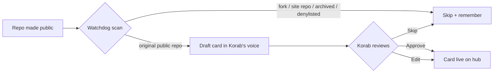

# Portfolio Hub Redesign (korabeland.github.io)

## Summary

Rebuild korabeland.github.io as a lean, single-page **project hub** with a new visual identity: a curated grid of public-repo cards that link out to GitHub, plus a brief about and contact. A watchdog process keeps it current — when a new public repo appears, it drafts a card in Korab's voice and surfaces it for approval before it goes live.

---

## Problem Frame

The portfolio site is currently scaffolding: three generic sample case studies (`lead-scoring`, `forecasting`, `chatbot-eval`), a "How I Work" framework block, one sample note, and an "intersection of CX, data analysis, and AI" hero that predates Korab's current "I build with AI" positioning. The parent `STRATEGY.md` had also shelved the site — Approach C made korabeland.com the consolidated home for both bio and case studies, leaving korabeland.github.io deferred "until case study volume justifies a split."

That consolidation no longer matches intent. Korab wants a clear division of labor: korabeland.com carries the personhood and writing; korabeland.github.io should be the place his actual built work lives. But the strongest work is private (`personal-os`, the ATB pipeline, `pacha-story-forge`), so the public surface is thin today — and a hand-maintained site silently rots as repos get added and forgotten. The site needs to look intentional with a handful of projects, grow without manual upkeep, and read as evidence that Korab builds — not just talks about building.

---

## Actors

- A1. Visitor — hiring manager, technical peer, or collaborator. Scans the projects, clicks through to a repo, or reaches out.
- A2. Korab — owns voice, curation, and visual direction; approves or edits watchdog-drafted cards.
- A3. Watchdog process — detects newly-public repos, drafts cards in Korab's voice, and queues them for approval.

---

## Key Flows

- F1. Visitor browses the hub
  - **Trigger:** Visitor lands on korabeland.github.io (often via korabeland.com or a LinkedIn link).
  - **Actors:** A1
  - **Steps:** Reads the short intro → scans the projects grid → opens a repo, or reads the brief about → uses contact.
  - **Outcome:** Visitor understands what Korab builds and reaches a repo or a contact channel in one click.
  - **Covered by:** R1, R4, R5, R15, R16

- F2. New public repo → drafted → approved → live
  - **Trigger:** Korab makes a repo public (new repo, or an existing private repo flipped to public).
  - **Actors:** A3, A2
  - **Steps:** Watchdog runs on schedule → detects the repo → applies the inclusion filter → drafts a voice-card → queues it for approval → Korab approves / edits / skips → approved card is added to the site.
  - **Outcome:** The hub reflects the new repo without Korab hand-editing the site, and the card reads in his voice.
  - **Covered by:** R9, R10, R11, R12, R13

- F3. Visitor reaches out
  - **Trigger:** Visitor decides to make contact.
  - **Actors:** A1
  - **Steps:** Uses email / GitHub / LinkedIn from the contact section, or follows the cross-link to korabeland.com for the fuller picture.
  - **Outcome:** A clear, low-friction path to contact and to the personal site.
  - **Covered by:** R3, R16

---

## Requirements

**Site structure & content**
- R1. Single page with this order: short intro → projects grid → brief about → contact.
- R2. Remove the existing "How I Work" framework section, the three sample case-study pages (`src/pages/projects/lead-scoring.astro`, `forecasting.astro`, `chatbot-eval.astro`), and the Notes section (`src/pages/notes/`, `src/content/notes/`). Long-form writing lives on korabeland.com.
- R3. Cross-link to korabeland.com as the place for the fuller personal picture and writing.

**Project cards**
- R4. Each project renders as a curated card: project name, a one-line hook in Korab's voice, primary language/tech, and a link to the GitHub repo.
- R5. Cards link out to the repo. No on-site project detail or case-study pages — depth lives in the repo READMEs.
- R6. Only live, public, clickable repos appear. No "coming soon" or placeholder cards.
- R7. The curated set excludes forks (e.g. `gstack`) and the site repos themselves (`korabeland.github.io`, `korabeland.com`).
- R8. The layout must look intentional with the current thin set (~3: `perian`, `perian-jobsearch`, `fantasy-baseball-drafter`) and scale gracefully to ~6+ as repos are added.

**Watchdog / auto-update**
- R9. A watchdog process detects newly-public repos under the `korabeland` GitHub account (new repos and private→public flips).
- R10. On detection, it drafts a card for the repo in Korab's voice (hook + tech + repo link), not a verbatim copy of the GitHub description.
- R11. When a new repo is detected, the drafted card requires Korab's explicit approval (approve / edit / skip) before appearing live.
- R12. Detection applies an inclusion filter: include original, non-archived public repos; skip forks, archived/empty repos, the two site repos, and an editable denylist.
- R13. Skipped or declined repos are remembered so they are not re-surfaced on every run.

**Visual direction**
- R14. Replace the current grayscale-minimal system with a new visual identity, grounded in Korab's voice (understated, intentional, human). The specific direction is defined in a dedicated design pass, not in this document.

**About & contact**
- R15. A brief about section (a few sentences, Korab's voice) that establishes "builds with AI" and points to korabeland.com for depth.
- R16. Contact section with email, GitHub, and LinkedIn (X optional).

---

## Acceptance Examples

- AE1. **Covers R9, R10, R11, R12.** Given a new original public repo is pushed, when the watchdog runs, then it drafts a voice-card and queues it for approval — and does NOT publish it live unattended.
- AE2. **Covers R7, R12.** Given a newly-public repo that is a fork (e.g. `gstack`) or one of the site repos, when the watchdog runs, then it is skipped and not surfaced for approval.
- AE3. **Covers R11, R13.** Given a drafted card awaiting approval, when Korab approves it appears live; when Korab skips it, it does not appear and is not re-surfaced on the next run.
- AE4. **Covers R6.** Given the curated set, when the page renders, then only live public repos appear — no "coming soon" placeholders, even for known in-progress work.

---

## Success Criteria

- A visitor grasps what Korab builds in under a minute and reaches a repo or a contact channel in one click; the page reads as intentional even with ~3 projects.
- Korab makes a repo public and the hub reflects it shortly after — his only manual step is approving (or editing) the drafted card, never hand-coding the site.
- The hub reads as *proof Korab builds* for CX / PM / AI-strategy audiences, not as a software-engineer-only portfolio.
- Downstream handoff is clean: `ce-plan` can choose the watchdog host and run the design pass without having to re-decide product behavior, scope, or the curation model.

---

## Scope Boundaries

### Deferred for later

- On-site case studies / project detail pages — revisit only if a specific project warrants a deep dive.
- `StoryForge` (boiled-down `pacha-story-forge`) and a sanitized `personal-os` — these enter the hub automatically via the watchdog once their repos are public; no special pre-release card.
- Distribution/analytics changes beyond what already exists.

### Outside this product's identity

- Merging the two sites into one — the two-site split stays, with sharper roles.
- A blog / notes / long-form writing surface on this site — that lives on korabeland.com.
- Mirroring all of GitHub — the hub is curated, never a full repo dump.
- Positioning the site as a pure software-engineer portfolio rather than proof-of-building for operator/AI roles.

---

## Key Decisions

- Keep two sites, sharpen roles: korabeland.com = personhood/writing, korabeland.github.io = proof-of-building index. Rationale: each site does one job well; reverses the stale Approach-C consolidation.
- Cards link out; no on-site case studies. Rationale: lowest maintenance, and depth already exists in repo READMEs.
- Watchdog drafts, Korab approves. Rationale: keeps the page curated and in-voice while removing manual upkeep; matches the "AI drafts, Korab refines" collaboration model.
- New visual direction, resolved in a dedicated design pass. Rationale: a redesign is explicitly wanted, and aesthetic is best worked in a design workflow rather than asserted here.
- Frame as proof-of-building for CX/PM/AI-strategy roles. Rationale: target roles are not pure engineering; a curated build hub is differentiating evidence for the "I build with AI" throughline.

---

## Dependencies / Assumptions

- GitHub API / `gh` CLI access for repo detection (the `gh` CLI is already authenticated as `korabeland`).
- Paperclip has been offline since 2026-04-19 with no auto-restart — it must NOT be assumed as the watchdog host. The host is an open planning question.
- Astro + GitHub Pages stack is retained (build + deploy via GitHub Actions on push to `main`).
- "Approval before live" implies a small persistent queue/state for pending cards and a record of skipped repos — the mechanism is a planning decision.

---

## Outstanding Questions

### Resolve Before Planning

- [Affects R14][User decision] Define the new visual direction (mood, typography, color, layout feel). Recommended via `/design-consultation`, grounded in `identity/writing-voice.md` and `identity/brand-archetype.md`.

### Deferred to Planning

- [Affects R9, R11][Technical][Needs research] Where does the watchdog run — a scheduled GitHub Action, a Claude Code scheduled agent/cron, or another runner? Note: GitHub Actions cannot trivially trigger on cross-repo creation, so a scheduled scan is the likely shape.
- [Affects R11][Technical] How does Korab actually approve a drafted card — a PR against the site repo, an approval queue file, an interactive prompt, or a notification (e.g. Telegram → approve)?
- [Affects R4, R10][Technical] How is per-repo card content stored (e.g. an Astro content collection / frontmatter) so approved cards persist and the watchdog can append new ones without clobbering edits?
