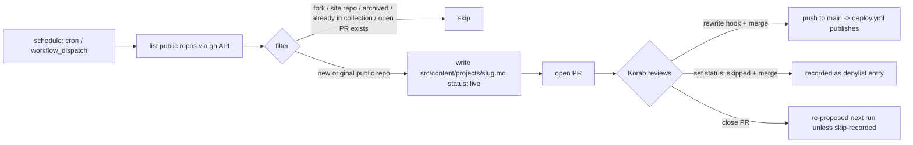

# feat: Rebuild korabeland.github.io as a self-updating project hub

**Target repo:** `portfolio-site/` (the working copy of `korabeland.github.io`). All paths below are repo-relative to that repo.

## Summary

Rebuild korabeland.github.io as a lean single-page **project hub** under the new "warm terminal" design system (`DESIGN.md`): a numbered editorial list of curated GitHub-repo cards that link out, a brief about, and contact. Replace the hardcoded project pages with a schema-validated `projects` content collection, then add a **scheduled GitHub Action watchdog** that detects new public repos and opens a PR proposing a card — merge to publish, merge-with-`status: skipped` to remember a rejection.

---

## Problem Frame

The site today is scaffolding: three generic sample case studies, a "How I Work" framework block, a `notes` blog section with one placeholder, and an outdated "CX + data + AI" hero. Projects are **100% hardcoded** (`src/pages/index.astro` plus three standalone `.astro` pages) with no content model, so adding work means editing markup, and the page silently rots as repos accumulate. The visual identity is the old grayscale system; the approved warm-terminal direction in `DESIGN.md` is entirely unimplemented.

The brainstorm (see origin) reframed the site: korabeland.com keeps the personhood and writing; korabeland.github.io becomes the curated, **self-updating** proof-of-building index. That requires three things this plan delivers: a real card content model, a full visual rebuild, and an automation that keeps the hub current without manual upkeep.

---

## System-Wide Impact

| Surface | Impact |
|---|---|
| `src/pages/index.astro` | Near-total rewrite — new sections, collection-driven projects. |
| `src/layouts/BaseLayout.astro` | Owns the new fonts, theme toggle, and grain overlay (single `<head>`/`<body>` owner). |
| `src/styles/global.css` | Replaced: grayscale tokens → warm-terminal tokens (light + dark). |
| Content model | New `projects` content collection; `notes` collection deleted. |
| `.github/workflows/` | New scheduled watchdog workflow with elevated `contents: write` + `pull-requests: write`. Existing `deploy.yml` unchanged. |
| Deletions | 3 case-study pages, `ProjectLayout`, all of `notes/`, `NoteLayout`, `#framework` section, stale Header nav, orphaned `PromptDownloadCard`, `public/downloads/` tree. |
| Docs | `CLAUDE.md`, `README.md`, `STRATEGY.md` rewritten to the new framing. |

---

## Key Technical Decisions

- **Card storage = Astro content collection, one file per repo** (`src/content/projects/{slug}.md`), schema-validated with Zod. Chosen over a single JSON data file: per-repo files avoid clobbering when the watchdog appends, give schema validation, and let "skip memory" live in the data itself. (see origin: card-storage open question)
- **Approval state + skip memory live inside the collection.** Each card carries `status: live | skipped`. The page renders only `live`. A rejected repo becomes a committed `status: skipped` file, which doubles as the denylist (R13). "Skip" = merge the PR after flipping `status` to `skipped`; "reject outright" = close the PR (the watchdog then re-proposes unless skip-recorded — see U6 dedup).
- **Content-layer API (Astro 5 `glob` loader), repo-wide.** The rebuild modernizes off the legacy collection API; the `notes` collection is deleted, so there is no mixed-API trap. Consumers use `getCollection` + `render(entry)` (not legacy `entry.body`).
- **Watchdog = scheduled GitHub Action → PR** (chosen by user over an LLM-in-CI drafting step or a local script). Reuses the existing push-to-main deploy: merging the PR triggers `deploy.yml`. The hook ships as the GitHub description placeholder; Korab rewrites it in his voice at PR review. No LLM API key in CI; voice stays human (archetype-aligned).
- **Build-time GitHub metadata** (`language`, `last_push`, public-repo count) for the "synced from github" flourish is resolved by a `prebuild` script with a committed fallback, mirroring korabeland.com's trail-register generator pattern — but the card data itself is **committed, not gitignored** (the PR-approval goal requires committed data; do NOT copy the gitignore+seed convention here). (see origin: learnings — trail-register precedent)
- **Static-target re-validation.** This is GitHub Pages static (`output: 'static'`), not Vercel SSR. No `import.meta.env.PROD` route guards (they need SSR); dev-only routes are excluded via `astro:build:done` or simply not shipped. Confirm Astro `base` is correct for the root-domain `korabeland.github.io`.

---

## High-Level Technical Design

*This illustrates the intended approach and is directional guidance for review, not implementation specification. The implementing agent should treat it as context, not code to reproduce.*

**Card content model (per-repo file):**

```
src/content/projects/perian.md
---
name: Perian
slug: perian
hook: <one-line, voice-crafted>        # GitHub description as starter; Korab rewrites
tech: [python, mlx]
repo_url: https://github.com/korabeland/perian
language: Python                        # build-time enriched
last_push: 2026-06-28                   # build-time enriched
order: 1                                # optional manual ordering
status: live                            # live | skipped
---
```

**Watchdog loop:**



---

## Output Structure

New/changed shape (additions and key replacements):

```
portfolio-site/
├── src/
│   ├── content.config.ts          # projects collection (replaces notes)
│   ├── content/projects/          # NEW — one .md per repo (seeded + watchdog-appended)
│   ├── components/
│   │   ├── ProjectList.astro       # NEW — numbered editorial list
│   │   ├── ProjectRow.astro        # NEW — single card row
│   │   ├── ThemeToggle.astro       # NEW
│   │   └── Header.astro / Footer.astro  # simplified to one variant
│   ├── layouts/BaseLayout.astro   # fonts + toggle + grain
│   ├── pages/index.astro          # rebuilt single page
│   └── styles/global.css          # warm-terminal tokens
├── scripts/
│   └── enrich-projects.ts          # NEW — build-time GitHub metadata
│   └── scan-repos.ts               # NEW — watchdog scan + draft
└── .github/workflows/
    ├── deploy.yml                  # unchanged
    └── watchdog.yml                # NEW — scheduled scan -> PR
```

The per-unit `**Files:**` sections are authoritative; the implementer may adjust layout.

---

## Implementation Units

### U1. Warm-terminal design-system foundation

**Goal:** Replace the grayscale system with the warm-terminal tokens, load the three fonts, and add the dark-default theme toggle + grain overlay in the shell.
**Requirements:** R14; `DESIGN.md` (typography, color tokens, decoration, a11y).
**Dependencies:** none.
**Files:** `src/styles/global.css` (rewrite), `src/layouts/BaseLayout.astro` (font links, grain overlay, toggle mount + inline no-flash script), `src/components/ThemeToggle.astro` (new), `tests/theme-toggle.test.ts` (new).
**Approach:** Define light + dark token tables from `DESIGN.md` as CSS custom properties under `:root` and `[data-theme="dark"]`. Load Space Grotesk + JetBrains Mono via Google Fonts and General Sans via Fontshare (`<link>` in `<head>`). Inline an `is:inline` head script that sets `data-theme` from `localStorage` (default dark when unset) before paint to avoid FOUC. Grain overlay as a `body::before` SVG-noise layer, disabled under `prefers-reduced-motion`.
**Patterns to follow:** existing `is:inline` usage (`Analytics.astro`), `interface Props` convention, centralized injection in `BaseLayout`.
**Test scenarios:**
- Default load with empty `localStorage` lands in dark mode (`data-theme="dark"`).
- Toggle click flips `data-theme` and persists the new value to `localStorage`.
- A stored preference is respected on next load (no flash to the other mode).
- `prefers-reduced-motion` disables the grain/transitions.
- `Covers AE` — none directly; this is foundation.

### U2. `projects` content collection + schema + seed launch set

**Goal:** Create the schema-validated `projects` collection (content-layer API) and seed the three launch cards; delete the `notes` collection.
**Requirements:** R4, R6, R8; supports R9–R13.
**Dependencies:** none (parallel to U1).
**Files:** `src/content.config.ts` (replace `notes` def with `projects` using `glob` loader + Zod schema), `src/content/projects/perian.md`, `src/content/projects/perian-jobsearch.md`, `src/content/projects/fantasy-baseball-drafter.md` (new seeds), delete `src/content/notes/sample-note.md`.
**Approach:** Schema fields per the High-Level design (`name, slug, hook, tech[], repo_url, language?, last_push?, order?, status`). `status` defaults to `live`. Seed the three current public repos; hooks start as GitHub descriptions (placeholders, Korab rewrites later). Use the Astro 5 `glob` loader so consumers use `getCollection('projects')` + `render`.
**Patterns to follow:** the legacy `notes` collection as a structural template, modernized to the content-layer API.
**Test scenarios:**
- Schema rejects a file missing `name`/`slug`/`repo_url` at build.
- `status` omitted defaults to `live`; `status: skipped` is accepted.
- `getCollection('projects')` returns the three seeds.
- `tech` accepts a string array; non-array fails validation.

### U3. Editorial project list + rebuilt `index.astro`

**Goal:** Build the numbered editorial-list centerpiece and the rebuilt single page (hero → projects → about → contact), rendering live cards from the collection.
**Requirements:** R1, R3, R4, R5, R8, R15, R16; F1, F3.
**Dependencies:** U1, U2.
**Files:** `src/components/ProjectList.astro` (new), `src/components/ProjectRow.astro` (new), `src/pages/index.astro` (rewrite), `src/pages/_dev/projects.astro` (new, dev-only preview route — not shipped), `tests/project-list.test.ts` (new).
**Approach:** Object-first per the captured workflow — build `ProjectList`/`ProjectRow` at the dev-only `_dev/projects` route and audit against `DESIGN.md` (type scale, mono indices, hover, divider rhythm) before wiring into `index.astro`. List filters `status === 'live'`, sorts by `order` then `last_push`. Rows: `NN / total` mono index, Space Grotesk name, voice hook, mono tech tags, `→ github` link (`target="_blank" rel="noopener noreferrer"`). About section cross-links korabeland.com; contact row Email · GitHub · LinkedIn. Exclude the dev route from the static build (`astro:build:done` filter or unbuilt path).
**Execution note:** Build the project-list centerpiece at the dev route and pass an adversarial design-fidelity audit before wiring app routes.
**Patterns to follow:** `interface Props`, `<slot/>`, external-link convention, `SkipLink`/`id="main"` landmark, centralized `Analytics`.
**Test scenarios:**
- Renders one row per `live` card, in `order`.
- A `status: skipped` card never renders.
- Index shows `NN / total` with `total` = count of live cards.
- Each row links to its `repo_url` with `rel="noopener noreferrer"`.
- Empty/one-card states still look intentional (no broken `total`).
- a11y: single `<main>`, skip link present, links keyboard-focusable, AA contrast for amber-on-bg.
- Responsive: rows reflow at <640px (index stacks above name).
- The `_dev/projects` route is absent from `dist/` after build.
- `Covers R5, R6` (links out, only live cards shown).

### U4. Remove dead surfaces + simplify Header/Footer

**Goal:** Delete the case studies, Notes, framework section, and prompt-library remnants; collapse Header/Footer to a single variant.
**Requirements:** R2.
**Dependencies:** U3 (page no longer references removed sections).
**Files:** delete `src/pages/projects/chatbot-eval.astro`, `src/pages/projects/forecasting.astro`, `src/pages/projects/lead-scoring.astro`, `src/layouts/ProjectLayout.astro`, `src/pages/notes/index.astro`, `src/pages/notes/[slug].astro`, `src/layouts/NoteLayout.astro`, `src/components/PromptDownloadCard.astro`, `public/downloads/` (tree); modify `src/components/Header.astro`, `src/components/Footer.astro`.
**Approach:** Remove the `How I Work` and `Field Notes` nav items; collapse the `'home' | 'subpage'` variant to one (single-page hub). Confirm `deploy.yml` references none of the deleted paths (research confirmed it doesn't) before removing. Drop obsolete GA4 events (`project_card_click`, `case_study_read_complete`, `artifact_open`); keep `github_click`, `contact_click`, `linkedin_click`.
**Patterns to follow:** existing Header/Footer structure, minus the variant branch.
**Test scenarios:** `Test expectation: build-level` — `astro build` succeeds with no unresolved imports or broken internal links after deletion; no remaining references to deleted components/routes (grep clean). Not feature-bearing.

### U5. Build-time GitHub metadata enrichment

**Goal:** Populate `language`, `last_push`, and the public-repo count for the "synced from github" flourish at build time, with a committed fallback.
**Requirements:** R8; `DESIGN.md` Technical Flourish.
**Dependencies:** U2.
**Files:** `scripts/enrich-projects.ts` (new), `package.json` (add `prebuild` hook), `src/data/github-meta.seed.json` (committed fallback, new), `tests/enrich-projects.test.ts` (new).
**Approach:** A `prebuild` Node script fetches public-repo metadata (via the GitHub REST API; unauthenticated is sufficient for public data, with `GITHUB_TOKEN` used in CI to avoid rate limits) and writes `language`/`last_push` into the relevant card files (or a build-time map the footer reads). Mirror korabeland.com's generator-with-seed pattern, but the **card files stay committed**. On API failure, fall back to the committed seed so the build never breaks.
**Test scenarios:**
- Given a successful API response, the script writes `language` + `last_push` for each live card.
- Given an API failure, the build uses the seed fallback and still succeeds.
- The footer count equals the number of live public repos.
- Malformed API payload is handled without crashing the build.

### U6. Watchdog scan-and-draft script

**Goal:** The brains of the watchdog: list public repos, apply the inclusion filter, dedup against the collection and open PRs, and emit pending card file(s).
**Requirements:** R9, R10, R12, R13; AE1, AE2.
**Dependencies:** U2 (card shape/schema).
**Files:** `scripts/scan-repos.ts` (new), `tests/scan-repos.test.ts` (new).
**Approach:** Use the GitHub API (or `gh`) to list `korabeland` repos. Inclusion filter: keep original, non-archived, public repos; drop forks, archived/empty, and the two site repos (`korabeland.github.io`, `korabeland.com`). Dedup: exclude any repo already present in `src/content/projects/` (any `status`, so `skipped` files suppress re-proposal — R13) and any repo with an open watchdog PR. For each genuinely new repo, generate `src/content/projects/{slug}.md` with `status: live` and the GitHub description as the starter hook. Pure function over an injected repo list so it is unit-testable without network.
**Test scenarios:**
- `Covers AE2` — a fork (e.g. `gstack`) or a site repo is filtered out.
- `Covers AE1` — a new original public repo produces a pending card file with `status: live` and starter hook, and is NOT published live unattended (it's a proposed file, gated by the PR in U7).
- A repo already present as `status: skipped` is not re-proposed (R13).
- A repo already present as `status: live` is not duplicated.
- An archived repo is filtered out.
- Slug generation is stable and filesystem-safe.

### U7. Scheduled watchdog workflow (scan → PR)

**Goal:** Run U6 on a schedule and open a PR with the proposed card(s).
**Requirements:** R9, R11; F2; AE3.
**Dependencies:** U6.
**Files:** `.github/workflows/watchdog.yml` (new).
**Approach:** `schedule:` cron (e.g. weekly) + `workflow_dispatch`. Permissions `contents: write`, `pull-requests: write`. Steps: checkout → setup-node 20 → `npm ci` → run `scripts/scan-repos.ts` → if new files were written, create a branch + open a PR (`peter-evans/create-pull-request` or `gh pr create`) titled `Add project card: {slug}`, body explaining "merge = publish; set status: skipped + merge = skip; close = reject." Merging triggers the existing `deploy.yml`. Do not open a PR when the scan produces no changes.
**Execution note:** Verify via `workflow_dispatch` dry-run (and/or `act` locally) — do not rely on waiting for the cron in CI.
**Test scenarios:** `Test expectation: workflow-level` (validated by dry-run, not unit tests) —
- `Covers F2/AE3` — a manual `workflow_dispatch` with a simulated new repo opens exactly one PR adding the card; no PR when there are no new repos.
- The PR branch contains only the new card file(s); the PR body documents the merge/skip/close semantics.
- Permissions are the minimum needed (`contents: write`, `pull-requests: write`) and no secret beyond `GITHUB_TOKEN` is required.
- Merging the PR triggers `deploy.yml` and the card appears live.

### U8. Documentation pass

**Goal:** Bring `CLAUDE.md`, `README.md`, and `STRATEGY.md` in line with the new hub framing and document the project-card + watchdog workflow.
**Requirements:** supports all; closes the brainstorm's doc drift.
**Dependencies:** U1–U7.
**Files:** `CLAUDE.md`, `README.md`, `STRATEGY.md`.
**Approach:** Rewrite the `CLAUDE.md` header framing (it still says "case studies"), delete the stale "New Project Case Study" and "New Prompt Library Content" sections, and add a "Project cards" section (collection location, schema, `status` semantics) plus a "Watchdog" section (workflow, PR approve/skip flow). Update `README.md`/`STRATEGY.md` from "case studies over repos" to "self-updating project hub." Do not introduce an `AGENTS.md` (per parent `feedback_claude_code_docs.md`).
**Test scenarios:** `Test expectation: none -- documentation only.`

---

## Scope Boundaries

### Deferred for later (from origin)

- On-site case studies / project detail pages — revisit only if a project warrants a deep dive.
- `StoryForge` (boiled-down `pacha-story-forge`) and sanitized `personal-os` — they enter the hub automatically via the watchdog once public; no special pre-release card.

### Outside this product's identity (from origin)

- Merging the two sites into one.
- A blog / notes / writing surface on this site (lives on korabeland.com).
- Mirroring all of GitHub — the hub stays curated.
- Positioning as a pure software-engineer portfolio rather than proof-of-building for operator/AI roles.

### Deferred to Follow-Up Work (plan-local)

- **LLM-drafted voice hooks in CI** — the alternative watchdog mode (Claude API drafts the hook automatically). Deferred; the chosen flow has Korab write hooks at PR review. Add later if manual hook-writing becomes a bottleneck.
- **Per-repo card ordering UI** — `order` is a manual frontmatter field for now; no admin surface.
- **Removing `public/downloads/` from git history** — this plan deletes the tree; history-rewrite (if desired for repo size) is separate.

---

## Risk Analysis & Mitigation

| Risk | Likelihood | Mitigation |
|---|---|---|
| Watchdog re-proposes a closed-PR repo (annoying loop) | Medium | Skip = merge-with-`status: skipped` (committed denylist). Document the close-vs-skip semantics in the PR body (U7). If "close = permanent reject" is wanted, add a closed-PR → skiplist step (deferred). |
| GitHub Pages `base` path / asset bugs (classic Astro-on-Pages failure) | Medium | Root-domain site, so `base` is likely default; verify in U3 build and check `dist/` asset paths. |
| Dev-only preview route leaks into the static build | Low | No SSR guard available; exclude via `astro:build:done` or keep it unbuilt; U3 test asserts it's absent from `dist/`. |
| Fontshare (General Sans) outage / FOUC | Low | System-font fallback in the stack; `font-display: swap`; consider self-hosting later. |
| API rate limits during enrichment/scan | Low | Use `GITHUB_TOKEN` in CI; committed seed fallback for enrichment (U5). |
| Elevated `contents: write` on the watchdog workflow | Low | Scoped to the one workflow, minimum permissions, no extra secrets; PR-gated (never publishes unattended). |

---

## Dependencies / Prerequisites

- Astro 5.17.3, Node 20 (existing).
- Fonts: Space Grotesk + JetBrains Mono (Google Fonts), General Sans (Fontshare).
- GitHub API access for public repos — `GITHUB_TOKEN` in CI; `gh` is locally authed as `korabeland` for manual runs.
- **Do NOT assume Paperclip** (offline since 2026-04-19) for any part of the watchdog.
- `DESIGN.md` is the visual source of truth (read before any UI work).

---

## Deferred to Implementation

- Exact Zod field nullability and default expressions for the `projects` schema.
- Whether build-time enrichment writes back into card files or into a side map the footer reads (decide when wiring U5).
- Exact PR-creation mechanism (`gh pr create` vs `peter-evans/create-pull-request`) and cron cadence (weekly vs daily) — settle in U7.
- Final font-loading strategy (CDN `<link>` vs self-hosted) pending a build-time FOUC check.
- Whether to keep a minimal `order` convention or sort purely by `last_push`.

---

## Verification Strategy

- **Build:** `astro build` succeeds; `dist/` has no dev routes and correct asset paths.
- **Visual:** the rebuilt page matches `DESIGN.md` (type scale, mono indices, hover, divider rhythm, both modes) — audited at the dev route before wiring (U3).
- **Watchdog:** `workflow_dispatch` dry-run opens exactly one PR for a simulated new repo, none when there are no new repos, and merging publishes via `deploy.yml`.
- **Traceability:** R1–R16, F1–F3, AE1–AE3 from the origin are each carried by a unit, test scenario, or scope boundary above.
